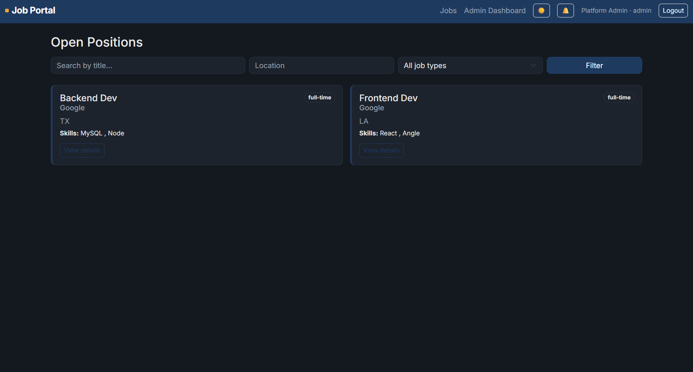
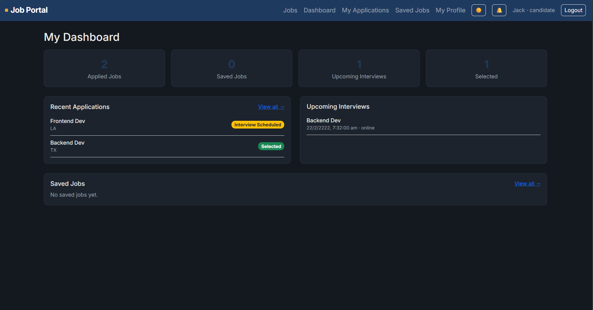
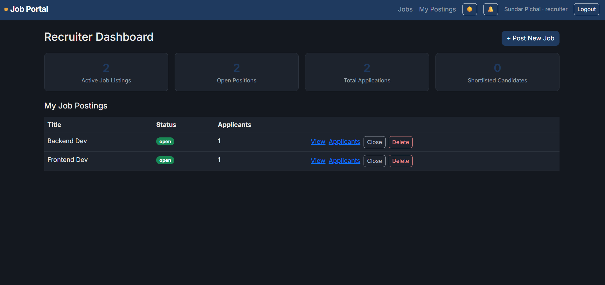
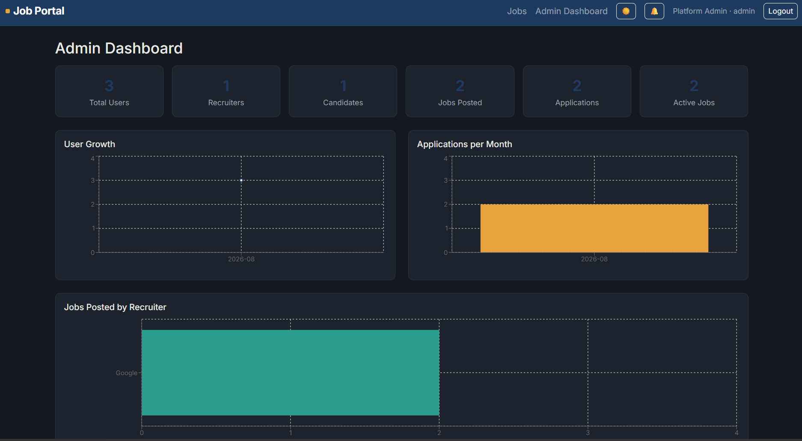
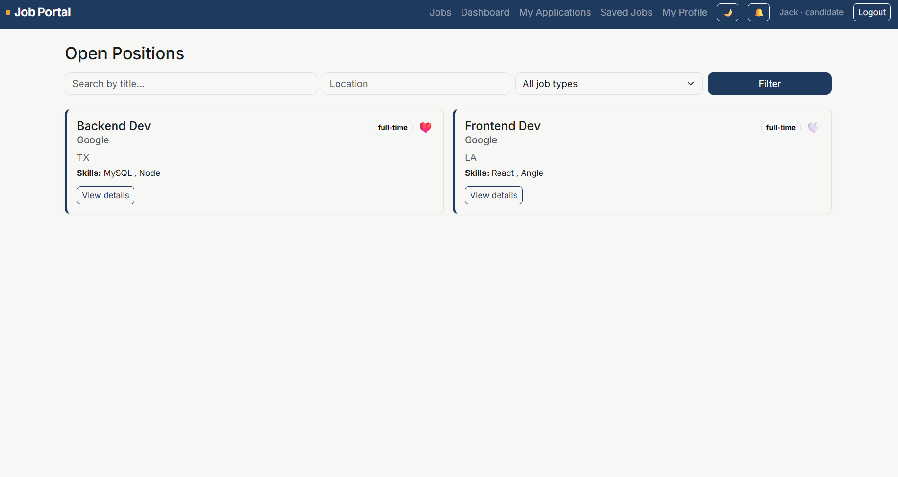
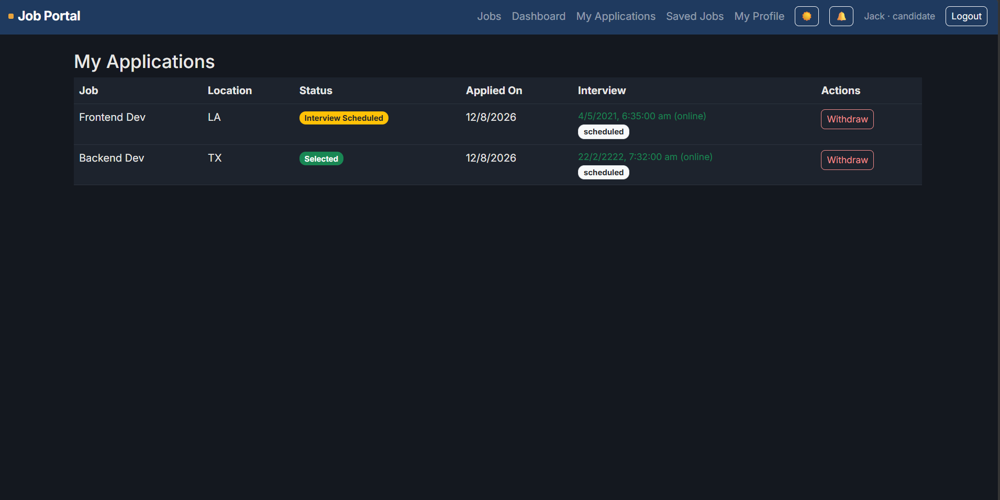

# Job Portal & Recruitment Management System

**🔗 Live Demo:** [job-portal-nine-tau.vercel.app](https://job-portal-nine-tau.vercel.app) &nbsp;|&nbsp; **⚙️ API Base:** `https://job-portal-rabw.onrender.com` &nbsp;|&nbsp; **📦 Repo:** `https://github.com/Abhay0063/Job_Portal` 


A full-stack recruitment platform connecting recruiters and candidates, with role-based dashboards, application tracking, interview scheduling, and an admin console for platform oversight.

Built as an internship deliverable. Every feature listed below has been manually tested against a live MySQL instance and a running Express server before being marked complete.

---

## Table of Contents

- [Project Overview](#project-overview)
- [Technology Stack](#technology-stack)
- [System Architecture](#system-architecture)
- [Database Schema](#database-schema)
- [Features](#features)
- [API Documentation](#api-documentation)
- [Installation Guide](#installation-guide)
- [Environment Variables](#environment-variables)
- [Deployment](#deployment)
- [Screenshots](#screenshots)
- [Known Limitations](#known-limitations)

---

## Project Overview

Job Portal is a three-role recruitment platform:

- **Candidates** browse and filter jobs, apply, save jobs for later, track application status, attend scheduled interviews, and manage a profile with a resume upload.
- **Recruiters** post and manage job listings, review applicants, update application status through a defined pipeline, schedule interviews, and view/update interview outcomes.
- **Admins** oversee the platform via a dashboard with usage statistics, growth charts, and user management.

The system supports the full recruitment lifecycle: `Applied → Under Review → Shortlisted → Interview Scheduled → Selected / Rejected`.

## Technology Stack

| Layer | Technology |
|---|---|
| Frontend | React 19 (Vite), React Router, Bootstrap 5, Recharts |
| Backend | Node.js, Express.js |
| Database | MySQL 8, Sequelize ORM |
| Authentication | JWT (jsonwebtoken), bcryptjs for password hashing |
| File Uploads | Multer (resume upload — PDF/DOC/DOCX, 5MB limit) |
| Notifications | Custom in-app notification system (polling-based) |

## System Architecture

```
┌─────────────────┐        HTTPS/JSON          ┌──────────────────┐        Sequelize ORM         ┌─────────────┐
│  React Frontend │ ───────────────────────►   |  Express Backend │ ───────────────────────────► │  MySQL DB   │
│  (Vite, port    │ ◄───────────────────────   |  (port 5000)     │ ◄─────────────────────────── │             │
│   5173)         │      JWT in headers        │                  │                              │             │
└─────────────────┘                            └──────────────────┘                              └─────────────┘
                                                        │
                                                        ▼
                                                 uploads/resumes/
                                                 (local disk storage)
```

**Request flow:** Every protected route passes through `protect` middleware (verifies JWT, attaches `req.user`) and, where relevant, `authorize(...roles)` middleware (enforces role-based access). Controllers never trust `req.body` for ownership — every update/delete re-verifies that the authenticated user actually owns the resource (e.g., a recruiter can only edit jobs tied to their own `Recruiter` profile, not by job ID alone).

**Folder structure:**
```
job-portal/
├── backend/
│   ├── config/database.js       # Sequelize connection
│   ├── models/                  # Sequelize models + associations (index.js)
│   ├── controllers/             # Business logic per resource
│   ├── routes/                  # Express route definitions
│   ├── middleware/               # auth (JWT + roles), resume upload (multer)
│   ├── utils/notify.js          # Notification creation helper
│   ├── seedAdmin.js             # One-time admin account creation
│   ├── sync.js                  # Creates/alters DB tables from models
│   └── server.js                # App entry point
└── frontend/
    └── src/
        ├── api/axios.js         # Axios instance, JWT interceptor, 401 auto-logout
        ├── context/              # Auth, Toast, Theme providers
        ├── components/           # Navbar, ProtectedRoute, NotificationBell
        └── pages/                 # One component per route
```

## Database Schema

Seven tables, matching the seven Sequelize models in `backend/models/`:

| Table | Purpose | Key Fields |
|---|---|---|
| `users` | Base identity for all roles | `email` (unique), `password` (hashed), `role` (enum: admin/recruiter/candidate) |
| `recruiters` | Company profile, 1:1 with a User | `userId` (FK), `companyName`, `companyWebsite` |
| `candidates` | Candidate profile, 1:1 with a User | `userId` (FK), `resumeUrl`, `skills`, `education`, `experienceYears` |
| `jobs` | Job postings | `recruiterId` (FK), `title`, `skillsRequired`, `experienceRequired`, `salaryMin/Max`, `status` (open/closed) |
| `applications` | A candidate's application to a job | `jobId` (FK), `candidateId` (FK), `status` (enum, see pipeline below) |
| `interviews` | Interview tied to one application | `applicationId` (FK, 1:1), `scheduledAt`, `status` (scheduled/completed/passed/failed) |
| `saved_jobs` | Candidate bookmarks | `candidateId` (FK), `jobId` (FK), unique per pair |
| `notifications` | In-app notifications | `userId` (FK), `message`, `link`, `isRead` |

**Relationships:**
```
User (1) ──── (1) Recruiter ──── (many) Job ──── (many) Application ──── (1) Interview
User (1) ──── (1) Candidate ─────────────────────────/         \
                    │                                            └── (many) SavedJob ── (many) Job
                    └── (many) Notification (via User, not Candidate)
```

All foreign-key relationships use `onDelete: CASCADE` — deleting a user removes their profile, and deleting an application removes its interview, so there are no orphaned records.

**Application status pipeline:** `applied → under_review → shortlisted → interview_scheduled → selected | rejected`. Scheduling an interview automatically advances the application to `interview_scheduled` — this is enforced server-side, not left to the recruiter to remember.

## Features

**Authentication & Roles**
- JWT-based auth, bcrypt password hashing, role-based route protection (frontend `ProtectedRoute` + backend `authorize()` middleware)
- Three roles: Admin (seeded via script, never via public registration), Recruiter, Candidate

**Recruiter**
- Post, edit, close/reopen job listings (title, description, location, salary range, skills required, experience required, job type)
- View applicants per job, update application status, schedule interviews, update interview status and add notes
- View and download/preview candidate resumes inline (PDF)

**Candidate**
- Browse/search/filter jobs by title, location, and job type, with pagination
- Apply to jobs, withdraw applications, save jobs for later
- Editable profile (skills, education, experience) with resume upload (PDF/DOC/DOCX)
- Track application status and interview schedule in one place

**Admin**
- Dashboard with platform-wide stats (total users, recruiters, candidates, jobs, applications, active jobs)
- Charts: user growth over time, applications per month, jobs posted by recruiter
- View and delete any user (cascades to their profile/jobs/applications)

**Cross-cutting**
- In-app notifications (new application received, status changes, interview scheduled/updated)
- Dark/light theme toggle, persisted per browser
- Toast notifications, skeleton loading states, empty states throughout
- Global error handling — a single bad request can't crash the server

## API Documentation

**Local base URL:** `http://localhost:5000/api/`
**Live base URL:** `https://job-portal-rabw.onrender.com/api` 
**Health check:** /api/health — e.g. `https://job-portal-rabw.onrender.com/api/health`, confirmed live, returns {"status":"ok","message":"Job Portal API is running"}
All protected routes require `Authorization: Bearer <token>`.

### Auth (`/auth`)
| Method | Endpoint | Access | Description |
|---|---|---|---|
| POST | `/auth/register` | Public | Register as recruiter or candidate |
| POST | `/auth/login` | Public | Returns `{ token, user }` |
| GET | `/auth/me` | Authenticated | Returns the current user |

### Jobs (`/jobs`)
| Method | Endpoint | Access | Description |
|---|---|---|---|
| GET | `/jobs` | Public | List open jobs. Query params: `search`, `location`, `jobType`, `page`, `limit` |
| GET | `/jobs/:id` | Public | Single job detail |
| POST | `/jobs` | Recruiter | Create a job |
| PUT | `/jobs/:id` | Recruiter (owner) | Update a job, including `status` to close/reopen |
| DELETE | `/jobs/:id` | Recruiter (owner) | Delete a job |
| GET | `/jobs/my/postings` | Recruiter | List the recruiter's own jobs with applicant counts |

### Applications (`/applications`)
| Method | Endpoint | Access | Description |
|---|---|---|---|
| POST | `/applications` | Candidate | Apply to a job (`jobId`, `coverLetter`) |
| GET | `/applications/my` | Candidate | List own applications with interview status |
| DELETE | `/applications/:id` | Candidate (owner) | Withdraw an application |
| GET | `/applications/job/:jobId` | Recruiter (owner) | List applicants for a job, with candidate + interview data |
| PUT | `/applications/:id/status` | Recruiter (owner) | Update status through the pipeline |

### Interviews (`/interviews`)
| Method | Endpoint | Access | Description |
|---|---|---|---|
| POST | `/interviews` | Recruiter (owner) | Schedule an interview (`applicationId`, `scheduledAt`, `mode`, `meetingLink`) |
| GET | `/interviews/my` | Candidate | List own scheduled interviews |
| PUT | `/interviews/:id` | Recruiter (owner) | Update status (scheduled/completed/passed/failed), notes, or reschedule |

### Candidates (`/candidates`)
| Method | Endpoint | Access | Description |
|---|---|---|---|
| GET | `/candidates/me` | Candidate | Own profile |
| PUT | `/candidates/me` | Candidate | Update skills, education, experience |
| POST | `/candidates/me/resume` | Candidate | Upload resume (multipart, field name `resume`) |
| POST | `/candidates/me/saved-jobs` | Candidate | Save a job (`jobId`) |
| DELETE | `/candidates/me/saved-jobs/:jobId` | Candidate | Unsave a job |
| GET | `/candidates/me/saved-jobs` | Candidate | List saved jobs |

### Admin (`/admin`)
| Method | Endpoint | Access | Description |
|---|---|---|---|
| GET | `/admin/dashboard` | Admin | Stats + chart data in one call |
| GET | `/admin/users` | Admin | List all users |
| DELETE | `/admin/users/:id` | Admin | Delete a user (cascades) |

### Notifications (`/notifications`)
| Method | Endpoint | Access | Description |
|---|---|---|---|
| GET | `/notifications/my` | Authenticated | List own notifications + unread count |
| PUT | `/notifications/:id/read` | Authenticated | Mark one as read |
| PUT | `/notifications/read-all` | Authenticated | Mark all as read |

**Standard error format:** `{ "message": "..." }` with an appropriate HTTP status (400 validation, 401 auth, 403 authorization, 404 not found, 409 conflict, 500 server error).

## Installation Guide

### Prerequisites
- Node.js (v18+)
- MySQL 8

### 1. Database
```sql
CREATE DATABASE job_portal_db;
CREATE USER 'job_portal_user'@'localhost' IDENTIFIED BY 'your_password_here';
GRANT ALL PRIVILEGES ON job_portal_db.* TO 'job_portal_user'@'localhost';
FLUSH PRIVILEGES;
```

### 2. Backend
```bash
cd backend
npm install
cp .env.example .env   # then fill in DB credentials and a real JWT_SECRET
npm run sync            # creates all tables
npm run seed:admin      # creates the one admin account
npm run dev
```

### 3. Frontend
```bash
cd frontend
npm install
npm run dev
```

Visit `http://localhost:5173`. Backend health check: `http://localhost:5000/api/health`.

## Environment Variables

Backend `.env` (see `backend/.env.example`):

| Variable | Description |
|---|---|
| `PORT` | Backend port (default 5000) |
| `DB_NAME`, `DB_USER`, `DB_PASSWORD`, `DB_HOST`, `DB_DIALECT` | MySQL connection |
| `JWT_SECRET` | Signs auth tokens — use a long random string, never commit a real one |
| `JWT_EXPIRES_IN` | Token lifetime (default `7d`) |
| `DB_SSL_REJECT_UNAUTHORIZED` | Set to `false` to connect to the hosted MySQL instance (Aiven) without validating its SSL certificate. **Disables certificate validation, not encryption** — see [Known Limitations](#known-limitations). |

## Deployment

**Stack:** Frontend on Vercel, backend on Render, database on Aiven (MySQL).

### 1. Database (Aiven)
1. Create a MySQL service on Aiven and wait for it to reach `Running` state.
2. From the service overview page, copy the connection details: host, port, user, password, and database name.
3. Download the service's CA certificate (**Overview → CA certificate → Download**). Aiven's MySQL requires SSL — connections without a valid CA will be rejected outright, so this file is mandatory, not optional.
4. In `backend/config/database.js`, load the CA and connect with `ssl: { ca: <cert contents>, rejectUnauthorized: true }` rather than `DB_SSL_REJECT_UNAUTHORIZED=false`. See [Known Limitations](#known-limitations) for why the bypass flag currently in use should be temporary.

### 2. Backend (Render)
1. Push `backend/` to a Git repo Render can access (root directory: `backend` if it's a subfolder of a monorepo).
2. Create a new **Web Service** on Render, connect the repo, set:
   - Build command: `npm install`
   - Start command: `npm start` (or `node backend/server.js`, matching your `package.json`)
3. Add all variables from [Environment Variables](#environment-variables) in Render's dashboard (**Environment** tab) — including the Aiven `DB_HOST`, `DB_PORT`, `DB_USER`, `DB_PASSWORD`, `DB_NAME`, and a real `JWT_SECRET`. Do not commit these values to the repo.
4. On first deploy, run the table sync and admin seed once, either via Render's **Shell** tab or a one-off job:
   ```bash
   npm run sync
   npm run seed:admin
   ```
   Do not run `sync` on every deploy — it's a one-time/schema-change step, not part of the normal start command.
5. Note the deployed backend URL — fill in below once confirmed:
   **Backend URL:** `https://job-portal-rabw.onrender.com` 
6. Render's free tier spins down on inactivity; the first request after idle can take 30–60s to respond. Mention this if demoing live.
7. **Database service must also stay reachable** — Aiven's free tier auto-powers-off after inactivity (see [Known Limitations](#known-limitations)). Confirm the Aiven service shows `Running`, not `Powered off` or `Rebuilding`, before demoing.

### 3. Frontend (Vercel)
1. Push `frontend/` to a Git repo, import it into Vercel, set root directory to `frontend` if needed.
2. Set the API base URL as a Vercel environment variable: `VITE_API_URL= https://job-portal-rabw.onrender.com/api/health`, and update `frontend/src/api/axios.js` to read it via `import.meta.env.VITE_API_URL` instead of a hardcoded `localhost:5000`.
3. Deploy. Vercel auto-builds on push once connected.
   **Deployed frontend URL:** `https://job-portal-nine-tau.vercel.app`
4. Add a `vercel.json` at the frontend root with a rewrite rule so client-side routes (e.g. `/login`) resolve correctly on direct hit or page refresh instead of returning a 404:
   ```json
   {
     "rewrites": [
       { "source": "/(.*)", "destination": "/index.html" }
     ]
   }
   ```
5. On Render, add `https://job-portal-nine-tau.vercel.app` to the backend's CORS allow-list so cross-origin requests aren't rejected.

### Post-deploy checklist
- [ ] Hit `https://job-portal-rabw.onrender.com/api/health` to confirm the backend is up and can reach Aiven.
- [ ] Log in as the seeded admin from the live frontend to confirm the full round trip (frontend → Render → Aiven) works.
- [ ] Confirm resume uploads still work — Render's disk is ephemeral, so uploaded files will not survive a redeploy or restart (already noted under Known Limitations).
- [ ] Replace `DB_SSL_REJECT_UNAUTHORIZED=false` with the Aiven CA cert before treating this as more than a demo deployment.

## Screenshots

> Images live in `docs/screenshots/`. Commit the PNGs with the exact filenames below and these will render automatically — no further README edits needed.

**Job Listing**


**Candidate DashBoard**


**Recruiter Applicant Dashboard**


**Admin Dashboard (charts)**


**Light Mode**


**Application**


## Known Limitations

- **Uploaded resumes are stored on local disk**, not cloud storage. On platforms with an ephemeral filesystem (most free-tier hosts), files may not survive a redeploy or restart — acceptable for a grading/demo deployment, not for production.
- **Notifications use polling** (every 30s), not WebSockets — sufficient for this scope, not real-time in the strictest sense.
- **DOC/DOCX resumes** can't be previewed inline in the browser (no native renderer) — they fall back to a download link; only PDF previews inline.
- The seeded admin password is visible in `seedAdmin.js` in plain text — fine for a local/demo environment, not a real production practice.
- **`DB_SSL_REJECT_UNAUTHORIZED=false` disables MySQL certificate validation** when connecting to the hosted database (Aiven). The connection is still encrypted, but the app will accept a certificate from any server, not just the real one — this makes the connection vulnerable to a man-in-the-middle attack in principle. It was set for expediency during initial deployment. The proper fix is to load Aiven's provided CA certificate and connect with `rejectUnauthorized: true`; this should be done before the project is treated as anything beyond a graded/demo deployment.